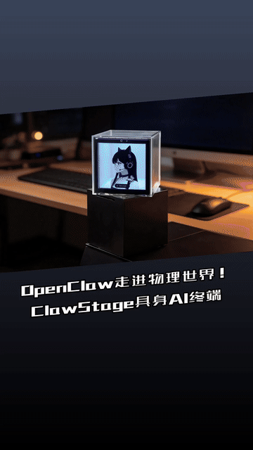
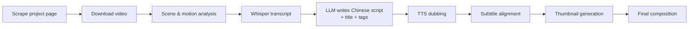

# Recut CLI

[](https://github.com/windstudio/recutcli/actions/workflows/ci.yml)
[](LICENSE)
[](pyproject.toml)

Auto-clip videos from supported websites (such as Kickstarter) into short social media videos with Chinese dubbing.

Point it at a project video page — Recut downloads the video, picks the most dynamic scenes by motion analysis, transcribes them with Whisper, writes a Chinese script with an LLM, dubs it with TTS, and burns in aligned subtitles. The output is a ready-to-post vertical video with a thumbnail intro.



▶ **[Watch the full demo (with audio)](https://github.com/windstudio/recutcli/releases/download/v0.1.0/ClawStage.mp4)**

## Motivation

Combining the open-source ffmpeg library with LLMs and multimodal models, you can build many kinds of video workflows — and along the way, smaller models such as Whisper, edge-tts, and Coqui each have a role to play.

This is an automatic video-clipping CLI I built a while back, now open-sourced. Feel free to install and use it as-is, or take it as a starting point to build your own video workflow. Hope you find it helpful.

## How it works



Scene selection is motion-driven: fragments are scored by average pixel difference across sampled frames (with a duration penalty), so the final cut favors the most engaging footage instead of arbitrary segments.

## Installation

```bash
pip install recut-cli
```

Or from source:

```bash
git clone https://github.com/windstudio/recutcli.git
cd recutcli
pip install .
```

### Requirements

- **Python** 3.10+
- **ffmpeg** on your system:
  - Windows: `winget install ffmpeg`
  - macOS: `brew install ffmpeg`
  - Linux: `apt install ffmpeg`
- **An OpenAI-compatible API key** for script generation (see [Configuration](#configuration))
- **Disk space**: `openai-whisper` pulls in PyTorch (~2 GB). On first run, the Whisper model is downloaded to `~/.cache/whisper` (~460 MB for the default `small` model).

## Usage

```bash
recut https://kickstarter.com/projects/xxx -o output.mp4
```

### Options

| Option | Description |
|--------|-------------|
| `-o, --output` | Output video file path (auto-generated from URL if not specified) |
| `--platform` | Target platform: tiktok, instagram, reels (default: tiktok) |
| `--duration` | Video duration in seconds (default: 30) |
| `--scene-threshold` | Scene change sensitivity (default: 0.3) |
| `--video-url` | Direct video URL (mp4, avi, m3u8, etc.) - bypass Kickstarter scraping |
| `--chs-title` | Chinese title - skip LLM title generation |
| `--title` | English title from video page (optional, used for generating Chinese title) |
| `--image` | Main image URL or path for thumbnail generation |
| `--tts-engine` | TTS engine: edge, coqui, minimax (default: edge) |
| `--pause-on-chs-script` | Pause after generating Chinese script for user review |
| `--resume` | Resume from checkpoint (directory or .md file path) |
| `--no-overwrite` | Fail if the output file already exists instead of overwriting |

### Examples

Basic usage:
```bash
recut https://kickstarter.com/projects/xxx -o output.mp4
```

With custom Chinese title and cover image:
```bash
recut https://kickstarter.com/projects/xxx -o output.mp4 \
  --chs-title "无狠活黑科技\n无狠活，不尬吹，只讲真东西" \
  --image "https://example.com/product.jpg"
```

With direct video URL:
```bash
recut https://kickstarter.com/projects/xxx -o output.mp4 \
  --video-url "https://example.com/video.mp4"
```

### Modes

Recut CLI supports two workflow modes:

**Automatic Mode** (default): Runs end-to-end without interruption. Best for batch processing.

**Semi-Automatic Mode**: Pauses after generating the Chinese script for user review. Use `--pause-on-chs-script` to enable:

```bash
recut https://kickstarter.com/projects/xxx -o output.mp4 --pause-on-chs-script
```

This pauses before TTS generation, allowing you to:
1. Review and edit the generated Chinese script in `output/output.md`
2. Edit scene selections in `output/output_scenes.json`
3. Resume when ready: `recut --resume output/` or `recut --resume output/output.md`

### Resume Workflow

When resuming from a paused checkpoint:

```bash
# First run - pauses after script generation
recut https://kickstarter.com/projects/xxx -o output.mp4 --pause-on-chs-script

# Edit the script and scenes as needed
# output/output.md          - Chinese script (title, transcript, tags)
# output/output_scenes.json - Scene timestamps with motion scores (motion_intensity)

# Resume processing
recut --resume output/
```

The `motion_intensity` in scenes.json represents motion intensity (×100). Higher values indicate more dynamic content. You can manually adjust scene selections by editing this file.

You can also resume from the .md file directly:

```bash
recut --resume output/output.md
```

### Output Structure

Running `recut https://kickstarter.com/projects/xxx/sample-project -o sample.mp4` generates:

```
output/
├── sample.mp4          # Final video with Chinese dubbing and subtitles
├── sample.md           # Chinese script with title, transcript, tags, and source URL
└── sample/             # Intermediate files
    ├── sample_metadata.json  # Checkpoint metadata for resume
    ├── sample_scenes.json    # Scene timestamps for video cutting
    ├── sample_script.md   # English transcript
    ├── sample_dubbing.wav # TTS-generated Chinese audio
    ├── sample_nodub.mp4   # Short video without dubbing
    ├── sample.srt         # Subtitle file
    ├── sample_raw.mp4     # Original downloaded video
    └── sample_thumb.jpg   # Thumbnail with Chinese title
```

### Video Features

- **Smart Fragment Selection**: Uses motion detection to select the most dynamic video segments. Fragments with higher motion intensity are prioritized, ensuring the final video captures the most engaging content.
- **Thumbnail Intro**: The first 0.5 seconds show a thumbnail with the Chinese title before the video content
- **Slanted Poster Thumbnail**: Thumbnails feature a slanted image mask, gradient background, and skewed title text
- **Logo Overlay**: If configured, a logo is displayed in the top-left corner throughout the video
- **Subtitles**: When a thumbnail intro is present, subtitles are delayed 0.5s so they don't show during the thumbnail display

## Getting the video URL manually

If Kickstarter blocks direct requests (403 error), grab the video URL from your browser instead:

1. Open the Kickstarter page in your browser
2. Open developer tools (F12) → Network tab
3. Filter for `m3u8` or `mp4` and copy the URL
4. Run with `--video-url`:

```bash
recut https://kickstarter.com/projects/xxx -o output.mp4 \
  --video-url "https://v2.kickstarter.com/..."
```

## Browser extension (coming soon)

A companion **Chrome extension** is in the works: it grabs a video's download URL, cover image, and title from the page with one click, then assembles a ready-to-paste `recut` command for you. It will be open-sourced under the same account and linked here once released.

## Configuration

Create a `.env` file in the project directory (see [.env.example](.env.example)):

```env
# LLM Configuration (required) — any OpenAI-compatible API works
LLM_API_KEY=your_api_key_here
LLM_API_URL=https://api.openai.com/v1
LLM_MODEL=gpt-4o-mini

# TTS Configuration (optional)
TTS_ENGINE=edge
TTS_VOICE=zh-CN-XiaoxiaoNeural
WHISPER_MODEL=small

# Thumbnail Configuration (optional)
THUMBNAIL_FONT=/path/to/chinese-font.ttf
THUMBNAIL_LOGO_PATH=material/logo.png
THUMBNAIL_FONT_SIZE_TITLE=72
```

### LLM Configuration

The tool supports any OpenAI-compatible API:

- **LLM_API_KEY** - Your API key (required)
- **LLM_API_URL** - API endpoint URL (default: `https://api.openai.com/v1`)
- **LLM_MODEL** - Model name (default: `gpt-4o-mini`)

For China-based users, point these at a domestic OpenAI-compatible endpoint, e.g. Yuanjing MaaS (`https://maas-api.ai-yuanjing.com/openapi/compatible-mode/v1`, model `glm-5`) or any other compatible provider.

### TTS Engines

- **edge** (default) - Microsoft Edge TTS, high quality Chinese voice
- **coqui** - Open-source TTS (requires Python 3.9-3.11, install with `pip install "recut-cli[tts-coqui]"`)
- **minimax** - MiniMax cloud TTS API, high quality Chinese voice

Each TTS engine has a different speaking speed. The tool automatically adjusts the Chinese script length to match the target duration:

| Engine | Character Rate | Target chars for 30s video |
|--------|---------------|----------------------------|
| edge | 3.5 chars/sec | ~105 chars |
| minimax | 4.5 chars/sec | ~135 chars |
| coqui | 3.5 chars/sec | ~105 chars |

Additionally, if the dubbing duration is shorter than the target, the tool automatically selects more video fragments to ensure the final video meets the target duration.

### MiniMax Configuration

To use MiniMax TTS, set these environment variables:

```env
MINIMAX_API_KEY=your-api-key
MINIMAX_API_URL=https://api.minimaxi.com/v1/t2a_v2
MINIMAX_VOICE_ID=moss_audio_ce44fc67-7ce3-11f0-8de5-96e35d26fb85
```

Get your API key from [MiniMax Platform](https://platform.minimaxi.com).

**Note**: MiniMax TTS uses volume level 3.0 (default is 1.0) for better audio output.

### Thumbnail Configuration

Configure thumbnail generation with these environment variables:

```env
# Chinese font for title display (auto-detected if not set)
THUMBNAIL_FONT=/path/to/font.ttf

# Optional: Default fonts to search (comma-separated, auto-detection)
THUMBNAIL_DEFAULT_FONTS=ZCOOLGaoDuanHei-Regular.ttf,NotoSansSC-Bold.ttf

# Optional: Font sizes
THUMBNAIL_FONT_SIZE_TITLE=72
THUMBNAIL_FONT_SIZE_SUBTITLE=14

# Optional: Logo to overlay throughout video (top-left corner, 70% opacity)
THUMBNAIL_LOGO_PATH=material/logo.png

# Optional: Outro video to append at the end
THUMBNAIL_OUTRO_PATH=material/outro.mp4
```

**Font Setup**: The tool auto-detects Chinese fonts (Zcool GaoDuanHei, Noto Sans SC, Source Han Sans, SimHei, etc.). For custom fonts, set `THUMBNAIL_FONT` to the font file path.

**Logo**: When `THUMBNAIL_LOGO_PATH` is set, the logo image will be overlaid on the entire video (not on the thumbnail image itself, to avoid overlap).

**Outro Video**: When `THUMBNAIL_OUTRO_PATH` is set and the file exists, the outro video will be appended to the final video. The outro keeps its original audio. No subtitles or logo overlay are applied to the outro.

## Disclaimer

This tool downloads and remixes third-party content. You are responsible for making sure your use of the source material and the resulting videos complies with the content owners' rights and the terms of service of the platforms you publish to.

## License

[MIT](LICENSE)
